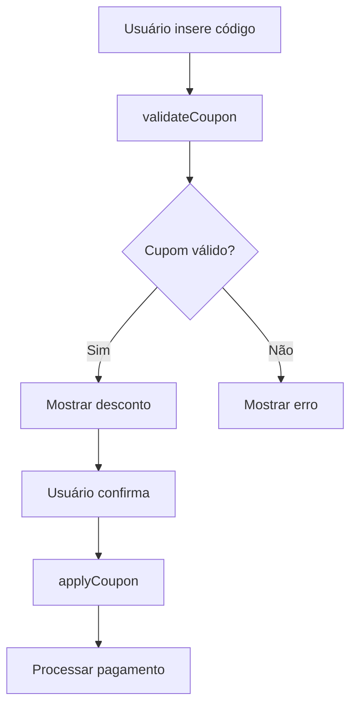
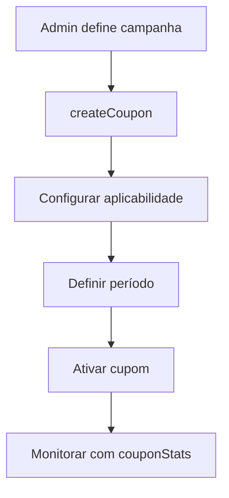

# CouponsResolver Documentation

## Overview
O `CouponsResolver` gerencia o sistema de cupons de desconto, incluindo consulta de cupons pessoais e administrativos, validação e aplicação de cupons, criação e edição de cupons (admin), estatísticas de uso e operações de gerenciamento.

## Localização
- **Arquivo**: `/back/src/graphql/resolvers/coupons.resolver.ts`
- **Módulo**: GraphQLAppModule
- **Guards**: JwtAuthGuard (globalmente), RolesGuard (operações admin)

## ⚠️ PROBLEMAS DE SEGURANÇA IDENTIFICADOS

### 🟡 Guards Inconsistentes
- **Global**: Usa `@UseGuards(JwtAuthGuard)` em vez de `GraphQLJwtAuthGuard`
- **Admin**: Usa `RolesGuard` em vez de `GraphQLRolesGuard`
- **Inconsistência**: Outros resolvers usam GraphQL variants

### 📝 Nota sobre Guards
O resolver usa guards HTTP em vez dos específicos para GraphQL, o que pode funcionar mas não segue o padrão do projeto.

## Endpoints

### Queries de Usuário

#### 1. `myCoupons`
**Descrição**: Lista cupons disponíveis para o usuário autenticado
```graphql
query MyCoupons {
  myCoupons {
    id
    code
    type
    value
    isPercentage
    minAmount
    maxDiscount
    usageLimit
    usedCount
    validFrom
    validUntil
    isActive
    applicablePlans
    description
  }
}
```

**Autenticação**: Requer `@UseGuards(JwtAuthGuard)`

**Retorno**: `[Coupon]` - Lista de cupons do usuário

**Fluxo de Negócio**:
1. Extrai userId do contexto da requisição
2. Busca cupons via `CouponsService.getCouponsForUser()`
3. Retorna cupons válidos e aplicáveis para o usuário

**Casos de Uso**:
- Dashboard de cupons do usuário
- Seleção de cupons no checkout
- Verificação de promoções disponíveis

---

### Queries Administrativas

#### 2. `allCoupons`
**Descrição**: Lista todos os cupons do sistema (admin)
```graphql
query AllCoupons {
  allCoupons {
    id
    code
    type
    value
    isPercentage
    minAmount
    maxDiscount
    usageLimit
    usedCount
    validFrom
    validUntil
    isActive
    applicablePlans
    description
    createdAt
    updatedAt
  }
}
```

**Autenticação**: `@UseGuards(RolesGuard)` + `@Roles(Role.ADMIN)`

**Retorno**: `[Coupon]` - Todos os cupons do sistema

**Uso**: Dashboard administrativo de cupons

---

#### 3. `couponStats`
**Descrição**: Estatísticas de uso de cupom específico
```graphql
query CouponStats($id: Int!) {
  couponStats(id: $id) {
    couponId
    totalUsage
    uniqueUsers
    totalDiscount
    averageOrderValue
    usageByPlan {
      planId
      planName
      usageCount
    }
    usageOverTime {
      date
      usageCount
    }
  }
}
```

**Autenticação**: `@UseGuards(RolesGuard)` + `@Roles(Role.ADMIN)`

**Parâmetros**:
- `id: Int!` - ID do cupom

**Retorno**: `CouponStats` - Estatísticas detalhadas de uso

**Métricas Incluídas**:
- Uso total e usuários únicos
- Desconto total concedido
- Valor médio de pedidos
- Distribuição de uso por plano
- Histórico de uso temporal

---

### Mutations de Usuário

#### 4. `validateCoupon`
**Descrição**: Valida cupom antes da aplicação
```graphql
mutation ValidateCoupon(
  $code: String!
  $planId: Int!
  $amount: Float!
) {
  validateCoupon(
    code: $code
    planId: $planId
    amount: $amount
  ) {
    isValid
    coupon {
      id
      code
      type
      value
      isPercentage
    }
    discountAmount
    finalAmount
    message
  }
}
```

**Autenticação**: Requer autenticação de usuário

**Parâmetros**:
- `code: String!` - Código do cupom
- `planId: Int!` - ID do plano para aplicar
- `amount: Float!` - Valor original

**Retorno**: `CouponValidationResult` - Resultado da validação

**Validações Realizadas**:
- Cupom existe e está ativo
- Data de validade
- Limite de uso
- Plano aplicável
- Valor mínimo
- Usuário elegível

**Fluxo de Negócio**:
1. Extrai userId do contexto
2. Chama `PaymentsService.validateCoupon()`
3. Retorna resultado com desconto calculado

**Integração**: `PaymentsService.validateCoupon(code, userId, planId, amount)`

---

#### 5. `applyCoupon`
**Descrição**: Aplica cupom a um pagamento específico
```graphql
mutation ApplyCoupon(
  $paymentId: Int!
  $code: String!
) {
  applyCoupon(
    paymentId: $paymentId
    code: $code
  ) {
    isValid
    coupon {
      id
      code
      value
      isPercentage
    }
    discountAmount
    finalAmount
    message
  }
}
```

**Autenticação**: Requer autenticação de usuário

**Parâmetros**:
- `paymentId: Int!` - ID do pagamento
- `code: String!` - Código do cupom

**Retorno**: `CouponValidationResult` - Resultado da aplicação

**Fluxo de Negócio**:
1. Valida se pagamento pertence ao usuário
2. Valida cupom para o contexto do pagamento
3. Aplica desconto ao pagamento
4. Registra uso do cupom
5. Retorna resultado atualizado

**Validações**:
- Pagamento deve pertencer ao usuário
- Cupom válido para o plano do pagamento
- Limite de uso respeitado
- Valor mínimo atendido

**Integração**: `PaymentsService.applyCouponToPayment(code, userId, paymentId)`

---

### Mutations Administrativas

#### 6. `createCoupon`
**Descrição**: Cria novo cupom
```graphql
mutation CreateCoupon($data: CreateCouponInput!) {
  createCoupon(data: $data) {
    id
    code
    type
    value
    isPercentage
    minAmount
    maxDiscount
    usageLimit
    validFrom
    validUntil
    isActive
    applicablePlans
    description
  }
}
```

**Autenticação**: `@UseGuards(RolesGuard)` + `@Roles(Role.ADMIN)`

**Parâmetros** (`CreateCouponInput`):
- `code: String!` - Código único do cupom
- `type: String!` - Tipo de cupom (COUPON_TYPE enum)
- `value: Float!` - Valor do desconto
- `isPercentage: Boolean!` - Se é percentual ou valor fixo
- `minAmount: Float` - Valor mínimo do pedido
- `maxDiscount: Float` - Desconto máximo (para percentuais)
- `usageLimit: Int` - Limite de usos
- `validFrom: String!` - Data de início
- `validUntil: String!` - Data de expiração
- `isActive: Boolean` - Status ativo/inativo
- `applicablePlans: String` - JSON com planos aplicáveis
- `description: String` - Descrição do cupom

**Retorno**: `Coupon` - Cupom criado

**Transformação de Dados**:
```typescript
const couponData = {
  ...data,
  applicablePlans: data.applicablePlans ? JSON.parse(data.applicablePlans) : undefined,
};
```

**Integração**: `CouponsService.createCoupon(couponData)`

---

#### 7. `updateCoupon`
**Descrição**: Atualiza cupom existente
```graphql
mutation UpdateCoupon($id: Int!, $data: UpdateCouponInput!) {
  updateCoupon(id: $id, data: $data) {
    id
    code
    type
    value
    # ... outros campos atualizados
  }
}
```

**Autenticação**: `@UseGuards(RolesGuard)` + `@Roles(Role.ADMIN)`

**Parâmetros**:
- `id: Int!` - ID do cupom
- `data: UpdateCouponInput!` - Campos para atualizar

**Retorno**: `Coupon` - Cupom atualizado

**Validações**:
- Cupom deve existir
- Código deve permanecer único (se alterado)
- Não pode invalidar cupons já usados

**Integração**: `CouponsService.updateCoupon(id, updateData)`

---

#### 8. `deleteCoupon`
**Descrição**: Remove cupom do sistema
```graphql
mutation DeleteCoupon($id: Int!) {
  deleteCoupon(id: $id) {
    success
    message
  }
}
```

**Autenticação**: `@UseGuards(RolesGuard)` + `@Roles(Role.ADMIN)`

**Parâmetros**:
- `id: Int!` - ID do cupom

**Retorno**: `DeleteCouponResponse`

**Comportamento**:
- Remove cupom permanentemente
- Não afeta pagamentos já processados com o cupom
- Retorna confirmação de sucesso

**Integração**: `CouponsService.deleteCoupon(id)`

---

## Integração com Serviços

### Serviços Utilizados
- **CouponsService**: CRUD e lógica de negócio de cupons
- **PaymentsService**: Validação e aplicação de cupons em pagamentos
- **Context extraction**: Obtenção de userId da requisição

### Arquitetura de Cupons
- **Validação**: Separada da aplicação para flexibilidade
- **Tipos**: Sistema baseado em enum COUPON_TYPE
- **Aplicabilidade**: Configurável por planos via JSON
- **Rastreamento**: Contadores de uso automáticos

---

## Sistema de Tipos de Cupom

### COUPON_TYPE Enum
```typescript
enum COUPON_TYPE {
  DISCOUNT = 'discount',           // Desconto simples
  FIRST_PURCHASE = 'first_purchase', // Primeiro pagamento
  SEASONAL = 'seasonal',          // Sazonal
  VIP = 'vip',                   // Usuários VIP
  REFERRAL = 'referral'          // Indicação
}
```

### Tipos de Desconto
- **Percentual**: `isPercentage: true` - Ex: 15% de desconto
- **Valor fixo**: `isPercentage: false` - Ex: R$ 50 de desconto

### Configuração de Aplicabilidade
```json
{
  "applicablePlans": [1, 2, 3],
  "excludeFreePlan": true,
  "minimumPlanTier": "premium"
}
```

---

## Validações de Cupom

### Validações Automáticas
1. **Existência**: Cupom existe no sistema
2. **Status**: `isActive: true`
3. **Período**: `validFrom <= hoje <= validUntil`
4. **Limite de uso**: `usedCount < usageLimit`
5. **Valor mínimo**: `pedidoValue >= minAmount`
6. **Plano aplicável**: Plano está na lista de aplicáveis
7. **Usuário elegível**: Não excedeu limites pessoais

### Cálculos de Desconto
```typescript
// Desconto percentual
discountAmount = Math.min(
  (orderAmount * coupon.value) / 100,
  coupon.maxDiscount || Infinity
);

// Desconto fixo
discountAmount = Math.min(coupon.value, orderAmount);

finalAmount = orderAmount - discountAmount;
```

---

## Fluxos de Negócio Principais

### Aplicação de Cupom no Checkout


### Criação de Campanha de Cupons


---

## Casos de Uso Comuns

### Interface de Usuário
```typescript
// Listar cupons disponíveis
const coupons = await myCoupons();

// Validar antes de aplicar
const validation = await validateCoupon({
  code: "PROMO15",
  planId: 1,
  amount: 99.90
});

if (validation.isValid) {
  // Mostrar desconto: R$ 99.90 -> R$ 84.42
  showDiscount(validation.discountAmount, validation.finalAmount);
}
```

### Checkout com Cupom
```typescript
// Durante o checkout
const result = await applyCoupon({
  paymentId: paymentId,
  code: userEnteredCode
});

if (result.isValid) {
  // Pagamento atualizado com desconto
  proceedToPayment(result.finalAmount);
} else {
  // Mostrar erro de validação
  showError(result.message);
}
```

### Administração de Cupons
```typescript
// Criar nova promoção
await createCoupon({
  data: {
    code: "BLACK2024",
    type: "seasonal",
    value: 30,
    isPercentage: true,
    maxDiscount: 100,
    usageLimit: 1000,
    validFrom: "2024-11-01",
    validUntil: "2024-11-30",
    applicablePlans: JSON.stringify([2, 3, 4])
  }
});

// Acompanhar desempenho
const stats = await couponStats({ id: couponId });
console.log(`Uso: ${stats.totalUsage}/${coupon.usageLimit}`);
```

---

## Tratamento de Erros

### Erros de Validação
| Cenário | Erro | Tratamento |
|---------|------|------------|
| Cupom não existe | "Cupom não encontrado" | Verificar código digitado |
| Cupom expirado | "Cupom expirado" | Mostrar data de expiração |
| Limite excedido | "Cupom esgotado" | Sugerir outros cupons |
| Plano inelegível | "Cupom não aplicável" | Mostrar planos válidos |
| Valor insuficiente | "Valor mínimo não atingido" | Mostrar valor necessário |

### Logs de Auditoria
- Tentativas de uso de cupom
- Aplicações bem-sucedidas
- Falhas de validação
- Criação/edição de cupons

---

## Segurança

### Controle de Acesso
- **Usuário**: Pode ver e usar cupons próprios
- **Admin**: CRUD completo + estatísticas
- **Guards**: Proteção por roles

### Validações de Segurança
- Cupons só podem ser usados pelo proprietário
- Verificação de propriedade de pagamentos
- Códigos únicos obrigatórios
- Limites de uso respeitados

### Prevenção de Fraudes
- Rastreamento de uso por usuário
- Validação server-side obrigatória
- Logs de todas as operações
- Limites temporais e quantitativos

---

## Performance

### Otimizações Implementadas
- Transformação JSON no resolver
- Validação em camadas (rápida validação primeiro)
- Uso de índices para busca por código

### Recomendações
- Cache para cupons frequentemente validados
- Pré-computação de estatísticas
- Índices compostos para queries complexas
- Cleanup de cupons expirados

---

## Problemas Conhecidos

### 🟡 Inconsistências de Guards
- Uso de `JwtAuthGuard` em vez de `GraphQLJwtAuthGuard`
- Uso de `RolesGuard` em vez de `GraphQLRolesGuard`
- Pode funcionar mas não segue padrão do projeto

### 🔄 Melhorias Sugeridas
- Padronizar guards com outros resolvers
- Implementar cupons personalizados por usuário
- Adicionar sistema de cupons automáticos
- Implementar stackable cupons
- Adicionar analytics avançadas

### 📊 Métricas Recomendadas
- Taxa de uso de cupons por campanha
- Valor médio de desconto por transação
- Cupons mais populares
- Taxa de conversão com cupons
- ROI de campanhas de cupom

---

## Extensibilidade

### Novos Tipos de Cupom
- Sistema flexível baseado em COUPON_TYPE
- Lógica customizável por tipo
- Validações específicas por categoria

### Funcionalidades Futuras
- Cupons com múltiplos critérios
- Cupons condicionais (compre X leve Y)
- Integração com programa de fidelidade
- Cupons automáticos baseados em comportamento
- API para parceiros criarem cupons