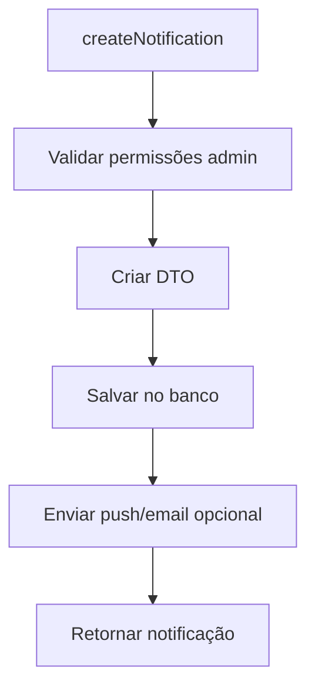
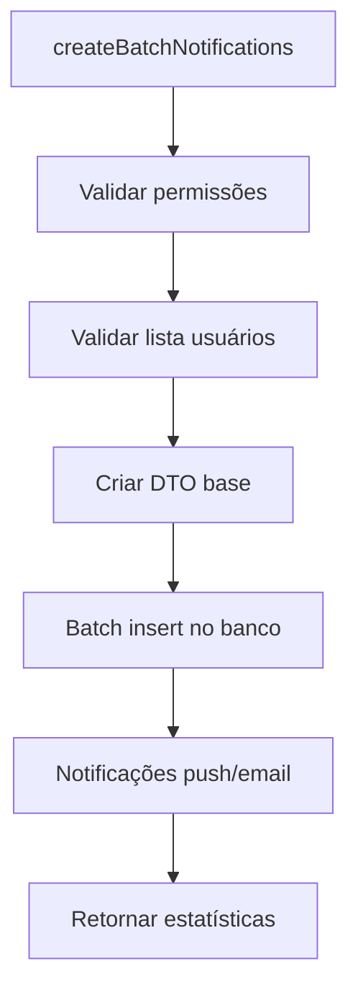
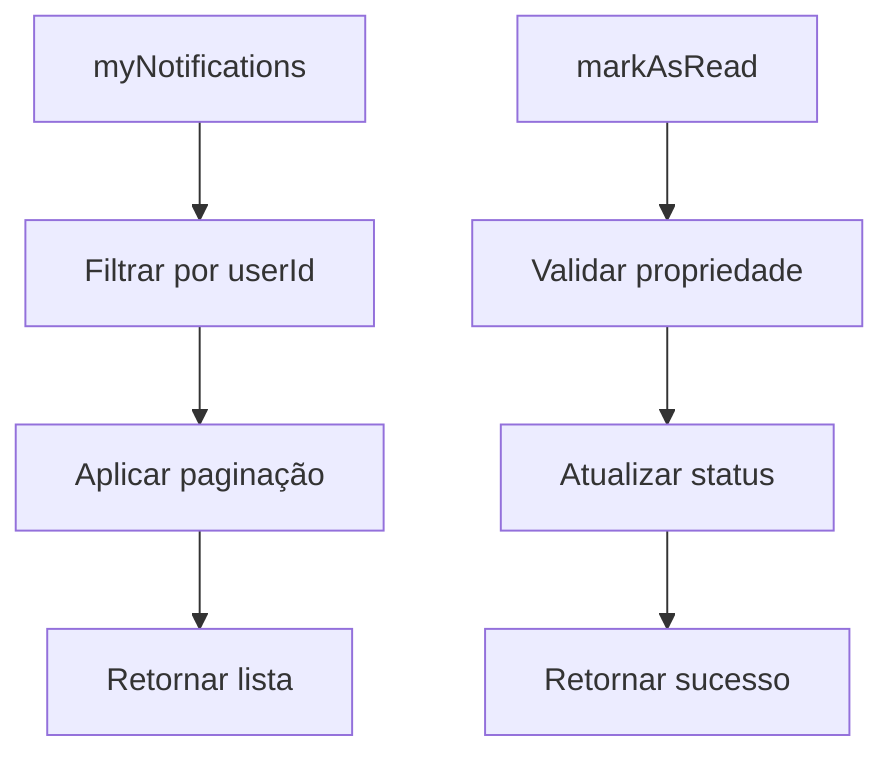

# NotificationsResolver Documentation

## Overview
O `NotificationsResolver` gerencia o sistema completo de notificações, incluindo consulta de notificações pessoais, gerenciamento de status de leitura, criação de notificações administrativas, notificações em lote e estatísticas de notificações.

## Localização
- **Arquivo**: `/back/src/graphql/resolvers/notifications.resolver.ts`
- **Módulo**: GraphQLAppModule
- **Guards**: GraphQLJwtAuthGuard, GraphQLRolesGuard (para operações admin)

## Endpoints

### Queries

#### 1. `myNotifications`
**Descrição**: Lista notificações do usuário autenticado com paginação
```graphql
query MyNotifications($limit: Int) {
  myNotifications(limit: $limit) {
    id
    title
    message
    type
    read
    createdAt
    updatedAt
    userId
  }
}
```

**Autenticação**: Requer `@UseGuards(GraphQLJwtAuthGuard)`

**Parâmetros**:
- `limit: Int` (padrão: 10) - Número máximo de notificações

**Retorno**: `[UserNotification]` - Lista de notificações do usuário

**Fluxo de Negócio**:
1. Busca notificações via `NotificationsService.getUserNotifications()`
2. Aplica paginação com limite especificado
3. Ordena por data de criação decrescente

**Logging**: Registra chamada e resultado com userId

---

#### 2. `myUnreadNotifications`
**Descrição**: Lista apenas notificações não lidas do usuário
```graphql
query MyUnreadNotifications {
  myUnreadNotifications {
    id
    title
    message
    type
    read
    createdAt
    userId
  }
}
```

**Autenticação**: Requer `@UseGuards(GraphQLJwtAuthGuard)`

**Retorno**: `[UserNotification]` - Notificações com `read: false`

**Filtro**: Apenas notificações onde `read = false`

**Uso Comum**: Badge de notificações, popup de alertas

---

#### 3. `myNewNotifications`
**Descrição**: Lista notificações recentes/novas do usuário
```graphql
query MyNewNotifications {
  myNewNotifications {
    id
    title
    message
    type
    read
    createdAt
    userId
  }
}
```

**Autenticação**: Requer `@UseGuards(GraphQLJwtAuthGuard)`

**Retorno**: `[UserNotification]` - Notificações recentes

**Critério**: Define-se "novas" baseado em critérios do serviço (ex: últimas 24h)

**Integração**: `NotificationsService.getNewNotifications()`

---

#### 4. `myNotificationsCount`
**Descrição**: Retorna contadores de notificações do usuário
```graphql
query MyNotificationsCount {
  myNotificationsCount {
    total
    unread
    new
    byType {
      type
      count
    }
  }
}
```

**Autenticação**: Requer `@UseGuards(GraphQLJwtAuthGuard)`

**Retorno**: `NotificationCount` - Estatísticas de notificações

**Campos Retornados**:
- `total`: Total de notificações
- `unread`: Notificações não lidas
- `new`: Notificações recentes
- `byType`: Contagem por tipo de notificação

**Uso**: Badges, indicadores de interface

**Logging**: Registra operação para debug

---

#### 5. `allNotificationsWithUser` (Admin)
**Descrição**: Lista todas as notificações do sistema com informações do usuário
```graphql
query AllNotificationsWithUser($limit: Int) {
  allNotificationsWithUser(limit: $limit) {
    id
    title
    message
    type
    read
    createdAt
    user {
      id
      email
      firstName
      lastName
    }
  }
}
```

**Autenticação**: `@UseGuards(GraphQLJwtAuthGuard, GraphQLRolesGuard)`
**Roles**: `@Roles(Role.ADMIN)`

**Parâmetros**:
- `limit: Int` (padrão: 100) - Limite de resultados

**Retorno**: `[NotificationWithUser]` - Notificações com dados do usuário

**Uso**: Dashboard administrativo, auditoria

**Integração**: `NotificationsService.getAllNotificationsWithUser()`

**Logging**: Registra acesso admin e resultado

---

### Mutations

#### 1. `markNotificationAsRead`
**Descrição**: Marca notificação específica como lida
```graphql
mutation MarkNotificationAsRead($id: Int!) {
  markNotificationAsRead(id: $id) {
    success
    message
  }
}
```

**Autenticação**: Requer `@UseGuards(GraphQLJwtAuthGuard)`

**Parâmetros**:
- `id: Int!` - ID da notificação

**Retorno**: `CommonResponse` - Status da operação

**Validações**:
- Notificação deve existir
- Usuário deve ser o proprietário da notificação

**Integração**: `NotificationsService.markAsRead(id, userId)`

---

#### 2. `markAllNotificationsAsRead`
**Descrição**: Marca todas as notificações do usuário como lidas
```graphql
mutation MarkAllNotificationsAsRead {
  markAllNotificationsAsRead {
    success
    message
    count
  }
}
```

**Autenticação**: Requer `@UseGuards(GraphQLJwtAuthGuard)`

**Retorno**: `CommonResponse` - Status e quantidade processada

**Fluxo de Negócio**:
1. Busca todas as notificações não lidas do usuário
2. Atualiza campo `read` para `true` em lote
3. Retorna quantidade de notificações marcadas

**Performance**: Operação em batch para eficiência

**Integração**: `NotificationsService.markAllAsRead(userId)`

---

#### 3. `deleteNotification`
**Descrição**: Remove notificação específica
```graphql
mutation DeleteNotification($id: Int!) {
  deleteNotification(id: $id) {
    success
    message
  }
}
```

**Autenticação**: Requer `@UseGuards(GraphQLJwtAuthGuard)`

**Parâmetros**:
- `id: Int!` - ID da notificação

**Retorno**: `CommonResponse` - Status da operação

**Validações**:
- Notificação deve existir
- Usuário deve ser o proprietário
- Operação permanente (não soft delete)

**Integração**: `NotificationsService.deleteNotification(id, userId)`

---

#### 4. `createNotification` (Admin)
**Descrição**: Cria notificação para usuário específico
```graphql
mutation CreateNotification(
  $title: String!
  $message: String!
  $type: String
  $userId: Int
) {
  createNotification(
    title: $title
    message: $message
    type: $type
    userId: $userId
  ) {
    id
    title
    message
    type
    read
    createdAt
    userId
  }
}
```

**Autenticação**: `@UseGuards(GraphQLJwtAuthGuard, GraphQLRolesGuard)`
**Roles**: `@Roles(Role.ADMIN, Role.SYSTEM_ADMIN, Role.MANAGER)`

**Parâmetros**:
- `title: String!` - Título da notificação
- `message: String!` - Conteúdo da mensagem
- `type: String` (padrão: "info") - Tipo da notificação
- `userId: Int` (opcional) - ID do destinatário, usa usuário atual se omitido

**Tipos de Notificação**:
- `info` - Informação geral
- `warning` - Aviso
- `error` - Erro
- `success` - Sucesso
- `system` - Sistema

**Retorno**: `UserNotification` - Notificação criada

**Fluxo de Negócio**:
1. Valida permissões administrativas
2. Cria DTO de notificação
3. Chama serviço de criação
4. Retorna notificação com ID gerado

**Logging**: Registra criação com usuário criador e destinatário

**Integração**: `NotificationsService.createNotification(createDto)`

---

#### 5. `createBatchNotifications` (Admin)
**Descrição**: Cria notificações em lote para múltiplos usuários
```graphql
mutation CreateBatchNotifications(
  $title: String!
  $message: String!
  $type: String
  $userIds: [Int!]!
) {
  createBatchNotifications(
    title: $title
    message: $message
    type: $type
    userIds: $userIds
  ) {
    success
    message
    count
  }
}
```

**Autenticação**: `@UseGuards(GraphQLJwtAuthGuard, GraphQLRolesGuard)`
**Roles**: `@Roles(Role.ADMIN, Role.SYSTEM_ADMIN, Role.MANAGER)`

**Parâmetros**:
- `title: String!` - Título da notificação
- `message: String!` - Conteúdo da mensagem
- `type: String` (padrão: "info") - Tipo da notificação
- `userIds: [Int!]!` - Lista de IDs dos destinatários

**Retorno**: `CommonResponse` - Status e quantidade processada

**Fluxo de Negócio**:
1. Valida lista de usuários
2. Cria DTO base da notificação
3. Chama serviço de criação em lote
4. Retorna estatísticas da operação

**Performance**: Criação otimizada em batch

**Casos de Uso**:
- Comunicados gerais
- Manutenção programada
- Atualizações de sistema
- Campanhas direcionadas

**Logging**: Registra operação em lote com quantidade

**Integração**: `NotificationsService.createNotificationsForUsers(userIds, createDto)`

---

## Integração com Serviços

### Serviços Utilizados
- **NotificationsService**: Toda lógica de negócio de notificações
- **SmartLogger**: Sistema de logging estruturado
- **CurrentUser decorator**: Injeção automática do usuário

### Padrões de Implementação
- **Service delegation**: Resolver delega para NotificationsService
- **Structured logging**: Uso do SmartLogger com contexto
- **DTO mapping**: Transformação de inputs GraphQL para DTOs de serviço

---

## Sistema de Tipos de Notificação

### Tipos Padrão
```typescript
enum NotificationType {
  INFO = 'info',           // Informações gerais
  WARNING = 'warning',     // Avisos importantes
  ERROR = 'error',         // Erros e problemas
  SUCCESS = 'success',     // Confirmações e sucessos
  SYSTEM = 'system',       // Notificações de sistema
  PAYMENT = 'payment',     // Relacionadas a pagamento
  ANALYSIS = 'analysis',   // Relacionadas a análises
  SHARE = 'share'          // Compartilhamentos
}
```

### Hierarquia de Importância
1. **ERROR**: Problemas críticos, alta prioridade
2. **WARNING**: Avisos importantes, média prioridade
3. **SYSTEM**: Comunicados de sistema, média prioridade
4. **INFO**: Informações gerais, baixa prioridade
5. **SUCCESS**: Confirmações, baixa prioridade

---

## Controle de Acesso

### Operações de Usuário
- `myNotifications` - Próprias notificações
- `myUnreadNotifications` - Próprias não lidas
- `myNewNotifications` - Próprias recentes
- `myNotificationsCount` - Próprios contadores
- `markNotificationAsRead` - Marcar próprias como lida
- `markAllNotificationsAsRead` - Marcar todas próprias como lidas
- `deleteNotification` - Deletar próprias notificações

### Operações Administrativas
- `allNotificationsWithUser` - Ver todas (auditoria)
- `createNotification` - Criar para usuário específico
- `createBatchNotifications` - Criar em lote

### Validações de Segurança
- Isolamento por userId em operações pessoais
- Verificação de propriedade antes de operações
- Roles guards para operações administrativas

---

## Fluxos de Negócio Principais

### Notificação Individual


### Notificações em Lote


### Gerenciamento Pessoal


---

## Logging e Auditoria

### Logs Estruturados
```typescript
// Exemplo de logging implementado
this.logger.log(`myNotifications called for user ${user.id}, limit: ${limit}`);
this.logger.log(`createBatchNotifications called by user ${user.id} for ${userIds.length} users`);
```

### Informações Registradas
- **Usuário**: ID e contexto da operação
- **Parâmetros**: Filtros e limites aplicados
- **Resultados**: Quantidade de notificações retornadas/processadas
- **Operações admin**: Registra criador e destinatários

### Auditoria Recomendada
- Volume de notificações por tipo
- Taxa de leitura por usuário
- Operações administrativas
- Performance de queries

---

## Casos de Uso Comuns

### Interface de Usuário
```typescript
// Badge de notificações
const count = await myNotificationsCount();
const badge = count.unread;

// Lista de notificações
const notifications = await myNotifications({ limit: 20 });

// Marcar como lida ao abrir
await markNotificationAsRead({ id: notificationId });
```

### Dashboard Administrativo
```typescript
// Ver todas as notificações para auditoria
const allNotifications = await allNotificationsWithUser({ limit: 100 });

// Criar comunicado geral
await createBatchNotifications({
  title: "Manutenção Programada",
  message: "Sistema ficará offline das 02h às 04h",
  type: "system",
  userIds: allActiveUserIds
});
```

### Integração com Outras Funcionalidades
```typescript
// Notificar sobre nova análise compartilhada
await createNotification({
  title: "Nova análise compartilhada",
  message: `${userName} compartilhou uma análise com você`,
  type: "share",
  userId: targetUserId
});

// Notificar sobre problema de pagamento
await createNotification({
  title: "Problema com pagamento",
  message: "Seu cartão foi recusado. Atualize seus dados de pagamento.",
  type: "payment",
  userId: userId
});
```

---

## Tratamento de Erros

### Erros Comuns
| Cenário | Erro | Tratamento |
|---------|------|------------|
| Notificação não encontrada | "Notification not found" | Validar ID antes de operações |
| Acesso negado | "Access denied" | Verificar propriedade |
| Usuário inválido | "User not found" | Validar userIds em batch |
| Sem permissão admin | Forbidden | Guards bloqueiam acesso |

### Validações de Input
- Títulos e mensagens obrigatórios
- Tipos de notificação válidos
- Lista de usuários não vazia para batch
- IDs numéricos válidos

---

## Performance

### Otimizações Implementadas
- Queries paginadas por padrão
- Operações em batch para múltiplas notificações
- Índices no banco para queries por userId
- Logging eficiente com contexto

### Recomendações
- Cache para contadores de notificação
- Cleanup automático de notificações antigas
- Push notifications para alertas importantes
- Agregação de notificações similares

---

## Problemas Conhecidos

### 🟡 Melhorias Sugeridas
- Implementar notificações push em tempo real
- Adicionar sistema de templates de notificação
- Implementar agrupamento de notificações similares
- Adicionar preferências de notificação por tipo
- Implementar cleanup automático de notificações antigas

### 📊 Métricas Recomendadas
- Taxa de leitura de notificações por tipo
- Volume de notificações por usuário/dia
- Performance de queries de notificação
- Taxa de engagement com notificações
- Eficácia de comunicados administrativos

---

## Extensibilidade

### Novos Tipos de Notificação
- Sistema flexível baseado em enum/string
- Fácil adição de novos tipos
- Comportamentos específicos por tipo

### Integrações Futuras
- WebSockets para notificações em tempo real
- Email notifications automáticas
- Push notifications mobile
- Integração com sistemas externos
- Webhooks para notificações importantes