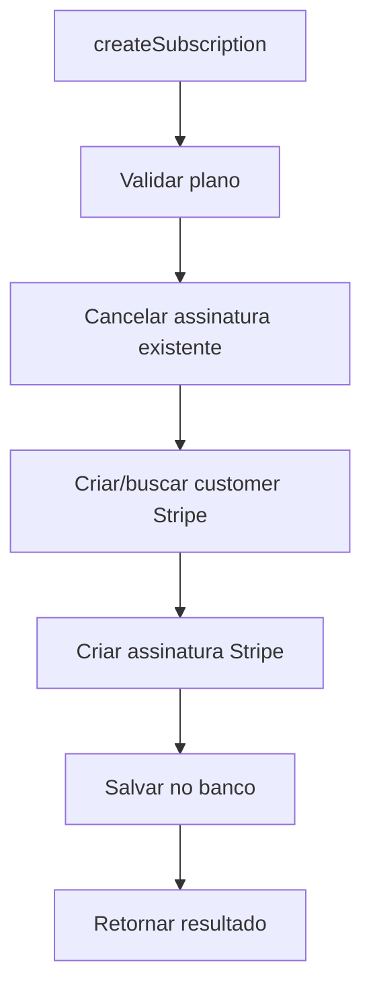
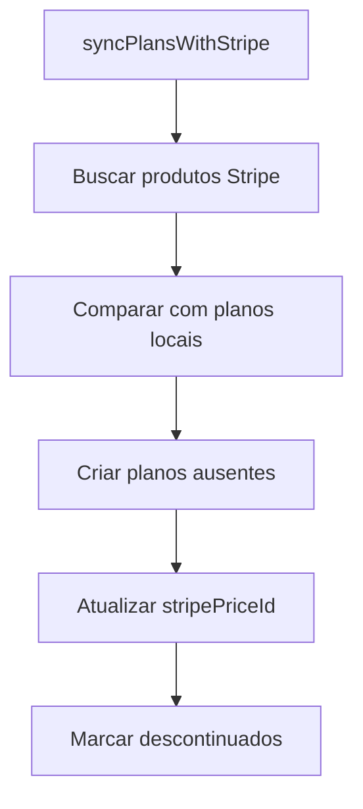

# PlanResolver Documentation

## Overview
O `PlanResolver` gerencia o sistema de planos de assinatura, incluindo CRUD de planos (apenas admins), consulta de planos públicos, gerenciamento de assinaturas de usuários, criação e cancelamento de assinaturas com integração Stripe.

## Localização
- **Arquivo**: `/back/src/graphql/resolvers/plan.resolver.ts`
- **Módulo**: GraphQLAppModule
- **Guards**: GraphQLJwtAuthGuard, GraphQLRolesGuard (para operações admin)

## Endpoints

### Queries

#### 1. `getAllPlans`
**Descrição**: Lista todos os planos ativos disponíveis para assinatura
```graphql
query GetAllPlans {
  getAllPlans {
    id
    name
    description
    price
    billingCycle
    features
    stripePriceId
    createdAt
    updatedAt
  }
}
```

**Autenticação**: Não requer autenticação (público)

**Retorno**: `[Plan]` - Lista de planos ordenada por preço crescente

**Filtros Aplicados**:
- `deleted_at: null` - Apenas planos não deletados
- Ordenação: Por preço crescente

**Transformações**:
- `createdAt/updatedAt`: Convertidos para ISO string
- Fallback para timestamps ausentes

**Uso Comum**: Página de preços, seleção de planos

---

#### 2. `getPlanById`
**Descrição**: Busca um plano específico por ID
```graphql
query GetPlanById($id: Int!) {
  getPlanById(id: $id) {
    id
    name
    description
    price
    billingCycle
    features
    stripePriceId
  }
}
```

**Autenticação**: Não requer autenticação (público)

**Parâmetros**:
- `id: Int!` - ID do plano

**Retorno**: `Plan?` - Plano encontrado ou null

**Validações**:
- Retorna null se plano não existe
- Não verifica deleted_at (pode retornar planos deletados)

---

#### 3. `mySubscriptions`
**Descrição**: Lista assinaturas do usuário autenticado
```graphql
query MySubscriptions {
  mySubscriptions {
    id
    userId
    planId
    status
    startSubDate
    cancelationDate
    stripeCustomerId
    stripeSubscriptionId
    createdAt
    updatedAt
    plan {
      id
      name
      description
      price
      billingCycle
      features
    }
  }
}
```

**Autenticação**: Requer `@UseGuards(GraphQLJwtAuthGuard)`

**Retorno**: `[Subscription]` - Lista de assinaturas com planos incluídos

**Relações Incluídas**:
- `plan`: Informações completas do plano associado

**Transformações**:
- Datas convertidas para ISO string
- Preços convertidos para Number
- Tratamento de campos opcionais

---

#### 4. `myPayments`
**Descrição**: Lista pagamentos relacionados às assinaturas do usuário
```graphql
query MyPayments {
  myPayments {
    id
    subscriptionId
    amount
    paymentDate
    nextPaymentDate
    paymentMethod
    transactionId
    status
    createdAt
    updatedAt
  }
}
```

**Autenticação**: Requer `@UseGuards(GraphQLJwtAuthGuard)`

**Retorno**: `[Payment]` - Pagamentos das assinaturas do usuário

**Filtro**: Apenas pagamentos de assinaturas do usuário autenticado

**Relações**: Inclui subscription e plan para contexto

---

### Mutations (Admin)

#### 1. `createPlan`
**Descrição**: Cria novo plano de assinatura
```graphql
mutation CreatePlan($input: CreatePlanInput!) {
  createPlan(input: $input) {
    id
    name
    description
    price
    billingCycle
    features
    stripePriceId
  }
}
```

**Autenticação**: `@UseGuards(GraphQLJwtAuthGuard, GraphQLRolesGuard)`
**Roles**: `@Roles(Role.ADMIN, Role.SYSTEM_ADMIN)`

**Parâmetros** (`CreatePlanInput`):
- `name: String!` - Nome do plano
- `description: String!` - Descrição detalhada
- `price: Float!` - Preço do plano
- `billingCycle: String!` - Ciclo de cobrança (monthly, yearly)
- `features: [String!]!` - Lista de features
- `stripePriceId: String` - ID do preço no Stripe

**Retorno**: `Plan` - Plano criado

**Fluxo de Negócio**:
1. Converte input para formato do serviço
2. Cria plano via `PlanService.createPlan()`
3. Retorna plano criado com ID gerado

**Integração**: `PlanService.createPlan()`

---

#### 2. `updatePlan`
**Descrição**: Atualiza plano existente
```graphql
mutation UpdatePlan($id: Int!, $input: UpdatePlanInput!) {
  updatePlan(id: $id, input: $input) {
    id
    name
    description
    price
    billingCycle
    features
    stripePriceId
  }
}
```

**Autenticação**: `@UseGuards(GraphQLJwtAuthGuard, GraphQLRolesGuard)`
**Roles**: `@Roles(Role.ADMIN, Role.SYSTEM_ADMIN)`

**Parâmetros**:
- `id: Int!` - ID do plano
- `input: UpdatePlanInput!` - Dados para atualizar

**Retorno**: `Plan` - Plano atualizado

**Validações**:
- Plano deve existir
- Campos opcionais podem ser omitidos

**Integração**: `PlanService.updatePlan()`

---

#### 3. `removePlan`
**Descrição**: Remove plano (soft delete)
```graphql
mutation RemovePlan($id: Int!) {
  removePlan(id: $id)
}
```

**Autenticação**: `@UseGuards(GraphQLJwtAuthGuard, GraphQLRolesGuard)`
**Roles**: `@Roles(Role.ADMIN, Role.SYSTEM_ADMIN)`

**Parâmetros**:
- `id: Int!` - ID do plano

**Retorno**: `Boolean` - true se removido com sucesso

**Comportamento**:
- Soft delete (marca deleted_at)
- Não afeta assinaturas existentes
- Plano não aparece mais em getAllPlans()

**Integração**: `PlanService.removePlan()`

---

#### 4. `syncPlansWithStripe`
**Descrição**: Sincroniza planos locais com Stripe
```graphql
mutation SyncPlansWithStripe {
  syncPlansWithStripe
}
```

**Autenticação**: `@UseGuards(GraphQLJwtAuthGuard, GraphQLRolesGuard)`
**Roles**: `@Roles(Role.ADMIN, Role.SYSTEM_ADMIN)`

**Retorno**: `Boolean` - true se sincronização bem-sucedida

**Fluxo de Negócio**:
1. Busca produtos/preços do Stripe
2. Compara com planos locais
3. Cria/atualiza planos conforme necessário
4. Atualiza stripePriceId nos planos existentes

**Integração**: `PlanService.syncWithStripe()`

**Uso**: Manter consistência entre local e Stripe

---

### Mutations (Usuário)

#### 1. `createSubscription`
**Descrição**: Cria nova assinatura para o usuário
```graphql
mutation CreateSubscription($input: CreateSubscriptionInput!) {
  createSubscription(input: $input) {
    success
    subscription {
      id
      status
      startSubDate
      plan {
        id
        name
        price
      }
    }
    clientSecret
  }
}
```

**Autenticação**: Requer `@UseGuards(GraphQLJwtAuthGuard)`

**Parâmetros** (`CreateSubscriptionInput`):
- `planId: Int!` - ID do plano desejado

**Retorno**: `CreateSubscriptionResponse`

**Fluxo de Negócio Complexo**:
1. **Validação do plano**:
   - Verifica se plano existe
   - Valida se tem stripePriceId configurado
2. **Gerenciamento de assinaturas existentes**:
   - Cancela assinatura ativa automaticamente
   - Atualiza status para 'CANCELLED' no banco
   - Cancela no Stripe se tiver stripeSubscriptionId
3. **Configuração do customer Stripe**:
   - Cria customer se não existe
   - Atualiza usuário com stripeCustomerId
4. **Criação da assinatura**:
   - Cria assinatura no Stripe com metadata
   - Cria registro no banco com status 'ACTIVE'
   - Inclui informações de billing
5. **Resposta**:
   - Retorna assinatura criada
   - Inclui clientSecret se payment_intent disponível

**Integração**:
- `StripeService.createCustomer()`
- `StripeService.createSubscription()`
- Prisma para operações no banco

**Comportamento Especial**:
- Auto-cancelamento de assinatura anterior
- Tratamento de falhas no Stripe (continua mesmo se cancelamento falhar)
- Metadata enviada para Stripe (userId, planId)

---

#### 2. `cancelSubscription`
**Descrição**: Cancela assinatura ativa do usuário
```graphql
mutation CancelSubscription {
  cancelSubscription
}
```

**Autenticação**: Requer `@UseGuards(GraphQLJwtAuthGuard)`

**Retorno**: `Boolean` - true se cancelada com sucesso

**Fluxo de Negócio**:
1. Busca assinatura ativa do usuário
2. Cancela no Stripe (se tiver stripeSubscriptionId)
3. Atualiza status no banco para 'CANCELLED'
4. Define cancelationDate como agora

**Validações**:
- Usuário deve ter assinatura ativa
- Erro se nenhuma assinatura ativa encontrada

**Integração**:
- `StripeService.cancelSubscription()`
- Prisma para atualização no banco

---

## Integração com Serviços

### Serviços Utilizados
- **PlanService**: CRUD de planos e sincronização
- **PrismaService**: Acesso direto ao banco
- **StripeService**: Integrações com Stripe API

### Integrações Stripe
- **Products/Prices**: Sincronização de planos
- **Customers**: Criação automática de customers
- **Subscriptions**: Gerenciamento de assinaturas
- **Webhooks**: Processamento de eventos (não no resolver)

### Banco de Dados
- **Tabelas principais**: Plan, Subscription, Payment, User
- **Relacionamentos**: 
  - Subscription -> Plan (many-to-one)
  - Subscription -> User (many-to-one)
  - Subscription -> Payment (one-to-many)

---

## Fluxos de Negócio Principais

### Criação de Assinatura


### Sincronização com Stripe


---

## Segurança e Validações

### Controle de Acesso
- **Queries públicas**: getAllPlans, getPlanById
- **Queries de usuário**: mySubscriptions, myPayments
- **Mutations admin**: createPlan, updatePlan, removePlan, syncPlansWithStripe
- **Mutations usuário**: createSubscription, cancelSubscription

### Validações de Negócio
- Planos devem ter stripePriceId para assinaturas
- Usuários só podem ter uma assinatura ativa por vez
- Cancelamento automático antes de nova assinatura
- Verificação de existência de planos

### Tratamento de Erros Stripe
- Falhas de cancelamento não impedem nova assinatura
- Logs de warning para falhas não críticas
- Continuidade do fluxo mesmo com erros parciais

---

## Transformação de Dados

### Conversões Padrão
```typescript
// Preços Decimal para Number
price: Number(plan.price)

// Datas para ISO string
createdAt: plan.createdAt?.toISOString() || new Date().toISOString()

// Tratamento de campos opcionais
cancelationDate: subscription.cancelationDate?.toISOString()
```

### Mapeamento de DTOs
- Conversão de GraphQL Input para formato de serviço
- Metadata estruturada para Stripe
- Campos calculados no retorno

---

## Casos de Uso Comuns

### Página de Preços
```typescript
// Listar planos disponíveis
const plans = await getAllPlans();
// Mostrar detalhes de plano específico
const plan = await getPlanById({ id: planId });
```

### Dashboard de Assinatura
```typescript
// Verificar assinatura atual
const subscriptions = await mySubscriptions();
const currentPlan = subscriptions.find(s => s.status === 'ACTIVE');
```

### Upgrade/Downgrade de Plano
```typescript
// Cancelar plano atual e criar novo (automático)
const { success, subscription } = await createSubscription({ 
  input: { planId: newPlanId } 
});
```

### Administração de Planos
```typescript
// Criar novo plano
await createPlan({ input: planData });
// Sincronizar com Stripe
await syncPlansWithStripe();
```

---

## Tratamento de Erros

### Erros Comuns
| Cenário | Erro | Tratamento |
|---------|------|------------|
| Plano inexistente | "Plano não encontrado" | Validação antes de operações |
| Sem stripePriceId | "Plano não configurado no Stripe" | Configurar preço no Stripe |
| Falha no cancelamento | Warning no log | Continua operação |
| Sem permissão admin | Forbidden | Guards bloqueiam acesso |

### Logs e Auditoria
- Todas as operações admin são logadas
- Criação/cancelamento de assinaturas
- Falhas de integração Stripe
- Operações de sincronização

---

## Problemas Conhecidos

### 🟡 Melhorias Sugeridas
- Implementar histórico de mudanças de plano
- Adicionar suporte a promoções e descontos
- Melhorar tratamento de webhooks Stripe
- Implementar cancelamento com data futura
- Adicionar validação de limites de uso

### 🔴 Pontos de Atenção
- Auto-cancelamento pode ser inesperado para usuários
- Falta validação de stripePriceId em createPlan
- Tratamento silencioso de falhas Stripe pode mascarar problemas

---

## Métricas e Monitoramento

### KPIs Recomendados
- Taxa de conversão por plano
- Churn rate por tipo de plano
- Revenue por plano
- Tempo médio de assinatura

### Alertas Sugeridos
- Falhas na sincronização Stripe
- Assinaturas órfãs (sem Stripe)
- Planos sem stripePriceId
- Volumes anômalos de cancelamento

---

## Performance

### Otimizações Implementadas
- Queries com include para evitar N+1
- Ordenação no banco (não na aplicação)
- Transformação eficiente de tipos

### Recomendações
- Cache para planos (dados estáticos)
- Índices para queries de assinatura por usuário
- Batch operations para operações admin
- Lazy loading para dados relacionados grandes