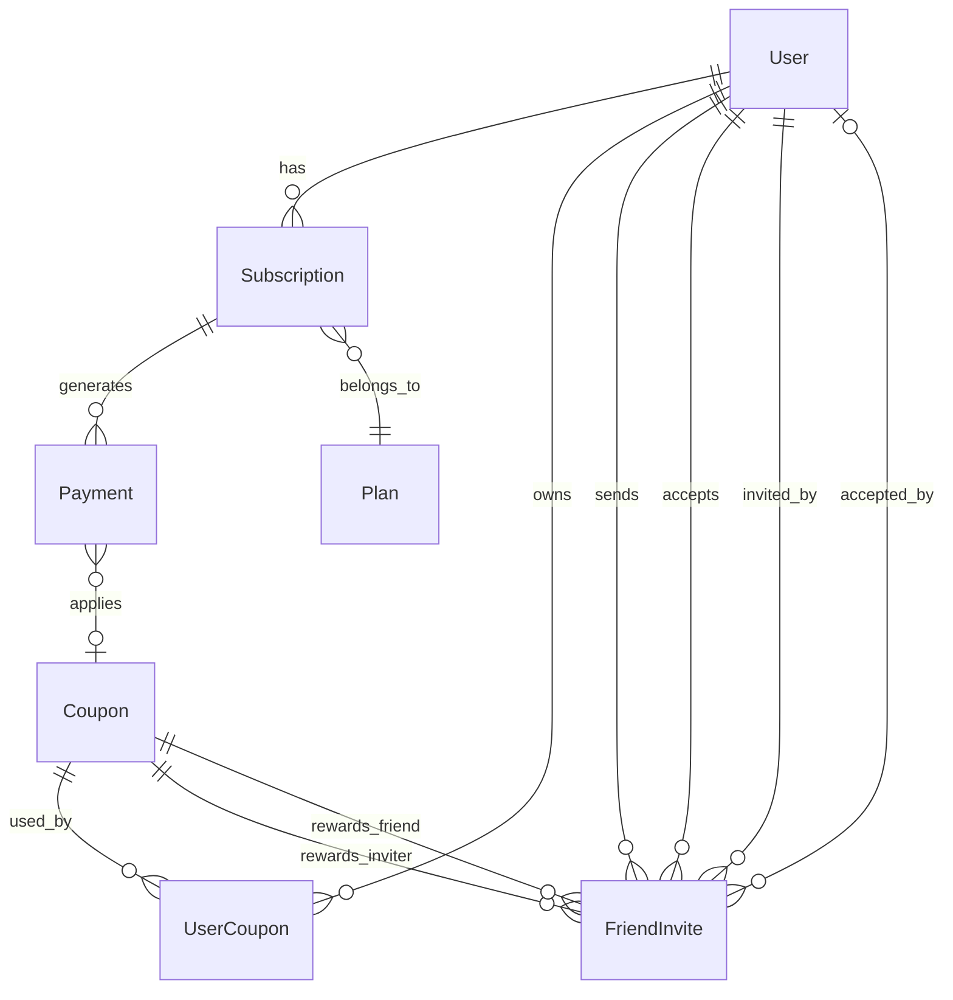
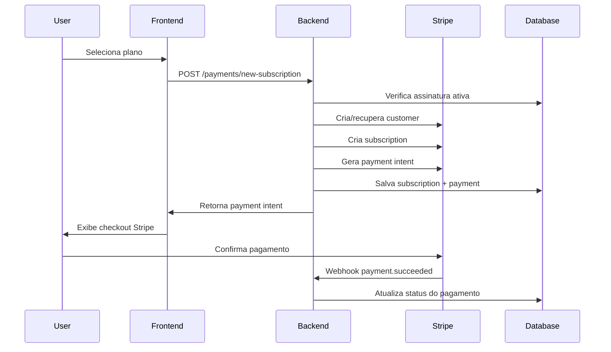
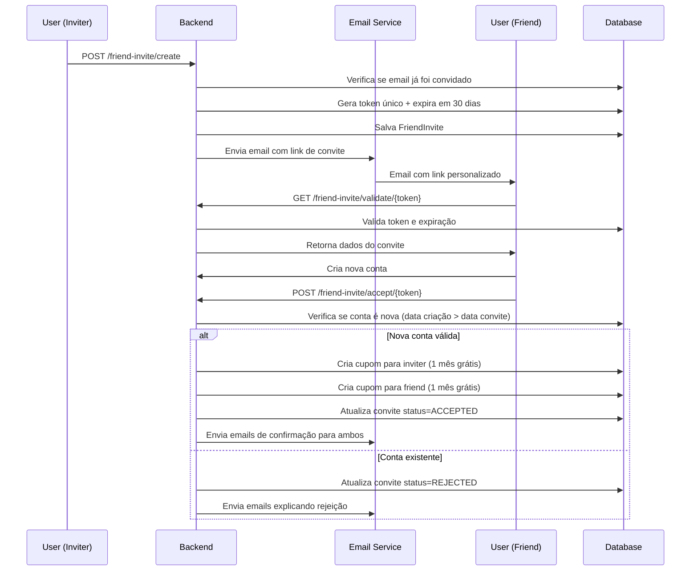
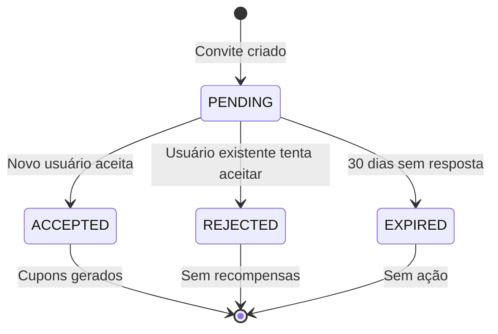

# Sistema de Pagamentos, Assinaturas e Referrals - Relable

## 📋 Visão Geral

O sistema de pagamentos do Relable é um módulo completo que gerencia:
- **Assinaturas recorrentes** com integração Stripe
- **Sistema de cupons** com múltiplos tipos de desconto
- **Programa de referrals (convite de amigos)** com recompensas automáticas

---

## 🏗️ Arquitetura do Sistema

### **Estrutura do Módulo de Pagamentos**

```
src/payments/
├── payments.service.ts          # Lógica principal de assinaturas
├── coupons.service.ts          # Gerenciamento de cupons
├── friend-invite.service.ts    # Sistema de referrals
├── recurring-payments.service.ts # Cobranças automáticas
├── payments.controller.ts      # Endpoints da API
├── coupons.controller.ts       # Endpoints de cupons
├── friend-invite.controller.ts # Endpoints de convites
└── dto/payment.dto.ts         # DTOs de transferência
```

### **Modelos de Banco de Dados**



---

## 💰 Sistema de Assinaturas

### **Fluxo Principal de Assinatura**



### **Código Principal - Criação de Assinatura**

**Arquivo**: `/src/payments/payments.service.ts:23-180`

```typescript
async newSubscription(userId: number, body: any) {
  this.logger.log(`Creating new subscription for user ${userId}`);

  // 1. Validar plano
  const plan = await this.prisma.plan.findFirst({
    where: { id: body.planId },
  });

  if (!plan || !plan.stripePriceId) {
    throw new NotFoundException('Plan not found or not configured');
  }

  // 2. Verificar assinatura ativa existente
  const lastActiveSub = await this.prisma.subscription.findFirst({
    where: { userId, AND: { status: PLANO_STATUS.ACTIVE } },
  });

  // 3. Criar/recuperar customer Stripe
  let customer = await this.getOrCreateStripeCustomer(userId);

  // 4. Criar assinatura no Stripe
  const stripeSubscription = await this.stripeService.createSubscription(
    customer.id,
    plan.stripePriceId,
    { userId: userId.toString(), planId: plan.id.toString() }
  );

  // 5. Processar assinatura (nova ou upgrade/downgrade)
  if (!lastActiveSub) {
    return await this.createNewSubscription(userId, body.planId, customer, stripeSubscription);
  } else {
    return await this.upgradeSubscription(userId, body.planId, lastActiveSub, customer, stripeSubscription);
  }
}
```

### **Funcionalidades Avançadas**

#### **1. Mudança de Planos**
- **Upgrade/Downgrade**: Calcula diferença de preço
- **Proration**: Utiliza `proration_behavior: 'none'` para cobrar apenas no próximo vencimento
- **Cancelamento automático**: Inativa plano anterior

#### **2. Pagamentos Recorrentes**
- **Cron Job**: Processa pagamentos vencidos automaticamente
- **Retry Logic**: Tenta reprocessar pagamentos falhados
- **Status Management**: Atualiza status de usuários (PAID, PAST_DUE, FREE)

**Código**: `/src/payments/payments.service.ts:719-983`

```typescript
async processRecurringPayments() {
  const overduePayments = await this.prisma.payment.findMany({
    where: {
      nextPaymentDate: { lte: new Date() },
      status: { in: [PAGAMENTO_STATUS.COMPLETED, PAGAMENTO_STATUS.PENDING] }
    },
    include: { subscription: { include: { user: true, plan: true } } }
  });

  for (const payment of overduePayments) {
    try {
      await this.processRecurringPayment(payment);
    } catch (error) {
      await this.handlePaymentFailure(payment, error.message);
    }
  }
}
```

---

## 🎟️ Sistema de Cupons

### **Tipos de Cupons Disponíveis**

| Tipo | Descrição | Valor | Comportamento |
|------|-----------|-------|---------------|
| `PERCENTAGE` | Desconto percentual | 1-100 | Reduz X% do valor |
| `FIXED_AMOUNT` | Valor fixo | Moeda | Reduz valor fixo |
| `FREE_MONTH` | Mês gratuito | 1 | Valor total = 0 |
| `FREE_SUBSCRIPTION` | Assinatura gratuita | N/A | Valor total = 0 |

### **Validação de Cupons**

**Arquivo**: `/src/payments/coupons.service.ts:64-186`

```typescript
async validateCoupon(
  code: string,
  userId: number, 
  planId: number,
  originalAmount: number
): Promise<CouponValidationResult> {
  
  // 1. Buscar cupom pelo código
  const coupon = await this.prisma.coupon.findUnique({
    where: { code: code.toUpperCase() }
  });

  // 2. Validações básicas
  if (!coupon || !coupon.isActive) {
    return { isValid: false, error: 'Cupom não encontrado ou inativo' };
  }

  // 3. Validação temporal
  if (isBefore(new Date(), coupon.validFrom) || 
      (coupon.validUntil && isAfter(new Date(), coupon.validUntil))) {
    return { isValid: false, error: 'Cupom fora do período de validade' };
  }

  // 4. Validação de limite de usos
  if (coupon.maxUses && coupon.usedCount >= coupon.maxUses) {
    return { isValid: false, error: 'Cupom esgotado' };
  }

  // 5. Verificar uso prévio pelo usuário
  const userCoupon = await this.prisma.userCoupon.findUnique({
    where: { userId_couponId: { userId, couponId: coupon.id } }
  });

  if (userCoupon && userCoupon.usedAt) {
    return { isValid: false, error: 'Cupom já utilizado por este usuário' };
  }

  // 6. Validar planos aplicáveis
  if (coupon.applicablePlans) {
    const applicablePlans = JSON.parse(coupon.applicablePlans);
    if (!applicablePlans.includes(planId)) {
      return { isValid: false, error: 'Cupom não válido para este plano' };
    }
  }

  // 7. Calcular desconto
  const { discountAmount, finalAmount } = this.calculateDiscount(coupon, originalAmount);

  return {
    isValid: true,
    coupon,
    discountAmount,
    originalAmount
  };
}
```

### **Aplicação de Cupons**

```typescript
async applyCoupon(couponId: number, userId: number, paymentId: number) {
  // 1. Registrar uso do cupom
  await this.prisma.userCoupon.upsert({
    where: { userId_couponId: { userId, couponId } },
    update: { usedAt: new Date() },
    create: { userId, couponId, usedAt: new Date() }
  });

  // 2. Incrementar contador de usos
  await this.prisma.coupon.update({
    where: { id: couponId },
    data: { usedCount: { increment: 1 } }
  });

  // 3. Atualizar pagamento com desconto
  await this.prisma.payment.update({
    where: { id: paymentId },
    data: {
      appliedCouponId: couponId,
      originalAmount: payment.amount,
      amount: new Prisma.Decimal(finalAmount),
      discountAmount: new Prisma.Decimal(discountAmount)
    }
  });
}
```

---

## 👥 Sistema de Referrals (Convite de Amigos)

### **Fluxo do Sistema de Referrals**



### **Validações do Sistema de Referrals**

**Arquivo**: `/src/payments/friend-invite.service.ts:22-76`

```typescript
async createInvite(userId: number, friendEmail: string, sentVia?: string) {
  // 1. Verificar convite duplicado
  const existingInvite = await this.prisma.friendInvite.findFirst({
    where: {
      inviterId: userId,
      friendEmail: friendEmail.toLowerCase(),
      status: { in: ['PENDING', 'ACCEPTED'] }
    }
  });

  if (existingInvite) {
    throw new BadRequestException('Você já convidou este email');
  }

  // 2. Verificar auto-convite
  const user = await this.prisma.user.findUnique({
    where: { id: userId },
    select: { email: true }
  });

  if (user.email.toLowerCase() === friendEmail.toLowerCase()) {
    throw new BadRequestException('Você não pode convidar a si mesmo');
  }

  // 3. Gerar token único e data de expiração
  const inviteToken = randomBytes(32).toString('hex');
  const expiresAt = new Date();
  expiresAt.setDate(expiresAt.getDate() + 30); // 30 dias

  // 4. Criar convite e enviar email
  const invite = await this.prisma.friendInvite.create({
    data: {
      inviterId: userId,
      friendEmail: friendEmail.toLowerCase(),
      inviteToken,
      expiresAt,
      sentVia: sentVia || 'EMAIL'
    },
    include: { inviter: { select: { fullName: true, email: true } } }
  });

  await this.sendInviteEmail(invite);
  return invite;
}
```

### **Lógica Anti-Fraude**

**Proteção contra usuários existentes**:

```typescript
// Verificar se o usuário que está aceitando é realmente novo
const inviteCreatedAt = invite.createdAt;
const userCreatedAt = acceptingUser.createdAt;

// Se a conta foi criada ANTES do convite, rejeitar
if (userCreatedAt < inviteCreatedAt) {
  const updatedInvite = await this.prisma.friendInvite.update({
    where: { id: invite.id },
    data: { 
      status: 'REJECTED',
      acceptedByUserId
      // NÃO gera cupons
    }
  });

  return {
    success: false,
    message: 'Este convite não pode ser usado por usuários que já possuem uma conta.',
    hasBenefits: false
  };
}
```

### **Geração Automática de Cupons**

**Arquivo**: `/src/payments/friend-invite.service.ts:281-312`

```typescript
private async createFriendInviteCoupon(
  userId: number,
  type: 'INVITER' | 'FRIEND',
  inviteId: number
) {
  const couponCode = `FRIEND_${type}_${inviteId}_${randomBytes(4).toString('hex').toUpperCase()}`;

  return this.prisma.coupon.create({
    data: {
      code: couponCode,
      name: type === 'INVITER' 
        ? 'Convite Aceito - 1 Mês Grátis' 
        : 'Convite de Amigo - 1 Mês Grátis',
      description: type === 'INVITER'
        ? 'Você ganhou 1 mês grátis por ter seu convite aceito!'
        : 'Você ganhou 1 mês grátis por aceitar o convite de um amigo!',
      type: 'FREE_MONTH',
      value: 1,
      maxUses: 1,
      isActive: true,
      validFrom: new Date(),
      validUntil: new Date(Date.now() + 365 * 24 * 60 * 60 * 1000), // 1 ano
      minSubscriptionMonths: 1,
      applicablePlans: null // Aplicável a todos os planos
    }
  });
}
```

---

## 📊 Integração Entre Sistemas

### **Como os Sistemas Se Conectam**

1. **Pagamentos + Cupons**:
   - Cupons são validados durante o checkout
   - Desconto é aplicado antes da criação da assinatura
   - Payment Intent reflete o valor com desconto

2. **Referrals + Cupons**:
   - Cupons são gerados automaticamente quando convites são aceitos
   - Cada usuário (inviter + friend) recebe cupom exclusivo
   - Cupons têm validade de 1 ano

3. **Assinaturas + Recorrência**:
   - Sistema de cron jobs processa pagamentos vencidos
   - Status de usuários é atualizado automaticamente
   - Emails são enviados para sucesso/falha de pagamentos

### **Estados e Transições**



---

## 🔧 Configurações e Constantes

### **Status de Pagamento**
```typescript
export enum PAGAMENTO_STATUS {
  PENDING = 'PENDING',
  COMPLETED = 'COMPLETED',
  FAILED = 'FAILED',
  CANCELLED = 'CANCELLED'
}
```

### **Status de Planos**
```typescript
export enum PLANO_STATUS {
  ACTIVE = 'ACTIVE',
  INACTIVE = 'INACTIVE',
  CANCELLED = 'CANCELLED'
}
```

### **Status de Membership**
```typescript
export enum MEMBERSHIP_STATUS {
  FREE = 'FREE',
  PAID = 'PAID',
  PAST_DUE = 'PAST_DUE'
}
```

---

## 🚀 Casos de Uso Principais

### **1. Usuário Assina Plano com Cupom**
```typescript
// 1. Frontend valida cupom
const validation = await paymentsService.validateCoupon(
  couponCode, userId, planId, planPrice
);

// 2. Cria PaymentIntent com desconto
const paymentIntent = await paymentsService.createPaymentIntentForCheckout(
  userId, planId
);

// 3. Aplica cupom ao pagamento
await paymentsService.applyCouponToPayment(
  couponCode, userId, paymentId
);

// 4. Stripe processa pagamento
// 5. Webhook confirma e cria assinatura
```

### **2. Usuario Convida Amigo**
```typescript
// 1. Criar convite
const invite = await friendInviteService.createInvite(
  userId, 'amigo@email.com', 'EMAIL'
);

// 2. Email automático é enviado
// 3. Amigo clica no link e se cadastra
// 4. Sistema detecta que é usuário novo
// 5. Cupons são gerados para ambos
// 6. Emails de confirmação são enviados
```

### **3. Cobrança Recorrente Automática**
```typescript
// Executado via cron job diariamente
await paymentsService.processRecurringPayments();

// Para cada pagamento vencido:
// 1. Valida customer Stripe
// 2. Cria novo PaymentIntent
// 3. Confirma pagamento automaticamente
// 4. Atualiza status do usuário
// 5. Envia email de confirmação
```

---

## 🔒 Segurança e Validações

### **Proteções Implementadas**

1. **Anti-Fraude em Referrals**:
   - Verificação de data de criação da conta
   - Token único com expiração
   - Limite de um convite por email

2. **Validação de Cupons**:
   - Verificação de uso prévio
   - Limites temporais e quantitativos
   - Aplicabilidade por planos específicos

3. **Segurança em Pagamentos**:
   - Integração oficial Stripe
   - Webhooks para confirmação
   - Logs detalhados de transações

---

## 🎯 Importância para o Sistema

### **Benefícios do Sistema de Assinaturas**
- **Receita Recorrente**: Automatiza cobranças mensais/anuais
- **Flexibilidade**: Permite upgrades/downgrades sem perder dados
- **Integração Stripe**: Processamento seguro de pagamentos internacionais

### **Benefícios do Sistema de Cupons**
- **Marketing**: Campanhas promocionais flexíveis
- **Retenção**: Incentivos para renovação de assinaturas
- **Onboarding**: Facilita adesão de novos usuários

### **Benefícios do Sistema de Referrals**
- **Crescimento Orgânico**: Usuários trazem novos usuários
- **Redução CAC**: Menor custo de aquisição por cliente
- **Fidelização**: Recompensas fortalecem relacionamento

Este sistema completo torna o Relable uma plataforma de SaaS robusta e escalável, com múltiplas fontes de receita e estratégias de crescimento integradas ao nível do código.

---

## 🧪 Estratégia de Testes

### **Estrutura de Testes do Sistema**

O sistema de pagamentos utiliza testes unitários e de integração para garantir a confiabilidade das funcionalidades críticas:

```
src/payments/
├── friend-invite.service.spec.ts    # Testes unitários do serviço de referrals
├── friend-invite.controller.spec.ts # Testes do controller de referrals
├── payments.service.spec.ts         # Testes do serviço de pagamentos
├── payments.controller.spec.ts      # Testes do controller de pagamentos
├── coupons.service.spec.ts          # Testes do sistema de cupons
└── coupons.controller.spec.ts       # Testes do controller de cupons
```

### **Tipos de Testes Implementados**

#### **1. Testes Unitários de Serviço**
- **Mocking completo**: Todas as dependências externas são mockadas
- **Isolamento**: Cada método é testado independentemente
- **Casos de borda**: Validações, erros e condições especiais

**Exemplo**: `friend-invite.service.spec.ts`

```typescript
describe('FriendInviteService', () => {
  let service: FriendInviteService;
  let prismaService: jest.Mocked<PrismaService>;
  let emailService: jest.Mocked<EmailService>;

  beforeEach(async () => {
    const mockPrismaService = {
      friendInvite: {
        findFirst: jest.fn(),
        create: jest.fn(),
        update: jest.fn()
      },
      user: { findUnique: jest.fn() },
      coupon: { create: jest.fn() }
    };

    const module = await Test.createTestingModule({
      providers: [
        FriendInviteService,
        { provide: PrismaService, useValue: mockPrismaService }
      ]
    }).compile();
  });
});
```

#### **2. Testes de Controller**
- **Validação de endpoints**: Testa a interface HTTP
- **Autenticação**: Verifica acesso com usuário autenticado
- **Formatação de resposta**: Garante estrutura consistente da API

**Exemplo**: Teste de criação de convite

```typescript
describe('create', () => {
  it('should create a new friend invite', async () => {
    const createInviteDto = {
      friendEmail: 'friend@test.com',
      sentVia: 'EMAIL'
    };

    friendInviteService.createInvite.mockResolvedValue(mockInvite);

    const result = await controller.create(mockRequest, createInviteDto);

    expect(result).toEqual({
      success: true,
      data: mockInvite
    });
  });
});
```

### **Cenários de Teste Cobertos**

#### **Sistema de Referrals**

**✅ Casos de Sucesso:**
- Criação de convite para email válido
- Aceitação de convite por usuário novo
- Geração automática de cupons
- Envio de emails de confirmação
- Validação de tokens únicos

**✅ Casos de Erro:**
- Convite duplicado para mesmo email
- Auto-convite (usuário convida a si mesmo)
- Convite expirado ou já processado
- Usuário existente tentando aceitar convite
- Token inválido ou email não correspondente

**✅ Lógica Anti-Fraude:**
```typescript
it('should reject invite for existing user (created before invite)', async () => {
  // Simula usuário criado ANTES do convite
  prismaService.user.findUnique.mockResolvedValue({
    ...mockExistingFriend,
    createdAt: new Date('2022-01-01') // Antes do convite
  });

  const result = await service.acceptInvite(inviteToken, acceptedByUserId);

  expect(result.success).toBe(false);
  expect(result.hasBenefits).toBe(false); // Sem cupons
  expect(prismaService.coupon.create).not.toHaveBeenCalled();
});
```

**✅ Estatísticas e Métricas:**
- Cálculo de taxa de conversão
- Contagem de convites enviados/aceitos
- Tratamento de divisão por zero

#### **Fluxos de Integração**

**✅ Fluxo Completo de Referral:**
```typescript
it('should handle complete invite flow', async () => {
  // 1. Criar convite
  const createResult = await controller.create(mockRequest, createDto);
  expect(createResult.success).toBe(true);

  // 2. Validar convite
  const validateResult = await controller.validate(mockInvite.inviteToken);
  expect(validateResult.valid).toBe(true);

  // 3. Aceitar convite
  const acceptResult = await controller.accept(newUserRequest, mockInvite.inviteToken);
  expect(acceptResult.success).toBe(true);
  expect(acceptResult.hasBenefits).toBe(true);
});
```

### **Configuração de Ambiente de Teste**

#### **Dependências de Teste**

```json
{
  "devDependencies": {
    "@nestjs/testing": "^9.0.0",
    "jest": "^29.0.0",
    "@types/jest": "^29.0.0",
    "ts-jest": "^29.0.0"
  }
}
```

#### **Scripts de Teste**

```json
{
  "scripts": {
    "test": "jest",
    "test:watch": "jest --watch",
    "test:cov": "jest --coverage",
    "test:debug": "node --inspect-brk -r tsconfig-paths/register -r ts-node/register node_modules/.bin/jest --runInBand"
  }
}
```

### **Estratégias de Mock**

#### **1. Mock de Dependências Externas**

```typescript
const mockPrismaService = {
  friendInvite: {
    findFirst: jest.fn(),
    findUnique: jest.fn(),
    create: jest.fn(),
    update: jest.fn(),
    count: jest.fn()
  },
  user: { findUnique: jest.fn() },
  coupon: { create: jest.fn() }
};
```

#### **2. Mock de Serviços Integrados**

```typescript
const mockEmailService = {
  sendTemplateEmail: jest.fn().mockResolvedValue(undefined)
};

const mockConfigService = {
  get: jest.fn().mockReturnValue('http://localhost:3000')
};
```

#### **3. Dados de Teste Consistentes**

```typescript
const mockUser = {
  id: 1,
  email: 'inviter@test.com',
  fullName: 'Test Inviter',
  createdAt: new Date('2023-01-01')
};

const mockInvite = {
  id: 1,
  inviterId: 1,
  friendEmail: 'friend@test.com',
  inviteToken: 'mock-token-123',
  status: 'PENDING',
  expiresAt: new Date('2024-02-01')
};
```

### **Padrões de Organização**

#### **1. Estrutura de Testes**

```typescript
describe('FriendInviteService', () => {
  // Setup global
  beforeEach(async () => { /* configuração */ });
  afterEach(() => { jest.clearAllMocks(); });

  describe('createInvite', () => {
    // Casos de sucesso
    it('should create a new invite successfully', async () => {});
    
    // Casos de erro
    it('should throw error if user already invited this email', async () => {});
    it('should throw error if user tries to invite themselves', async () => {});
    
    // Casos especiais
    it('should convert friend email to lowercase', async () => {});
  });

  describe('acceptInvite', () => {
    // Múltiplos cenários organizados logicamente
  });
});
```

#### **2. Nomenclatura Descritiva**

- **✅ Bom**: `should reject invite for existing user (created before invite)`
- **❌ Ruim**: `test accept invite error`

#### **3. Arrange-Act-Assert Pattern**

```typescript
it('should create a new invite successfully', async () => {
  // Arrange - Preparar dados e mocks
  const userId = 1;
  const friendEmail = 'friend@test.com';
  prismaService.friendInvite.findFirst.mockResolvedValue(null);

  // Act - Executar função
  const result = await service.createInvite(userId, friendEmail);

  // Assert - Verificar resultados
  expect(prismaService.friendInvite.create).toHaveBeenCalledWith(/*...*/);
  expect(result).toBeDefined();
});
```

### **Comandos de Execução**

#### **Executar Testes Específicos**

```bash
# Todos os testes do módulo de pagamentos
npm test -- src/payments

# Apenas testes de referrals
npm test -- friend-invite.service.spec.ts

# Com cobertura
npm run test:cov -- src/payments

# Modo watch (desenvolvimento)
npm run test:watch -- src/payments
```

### **Métricas de Cobertura**

O sistema deve manter cobertura mínima de:
- **Statements**: 90%+
- **Branches**: 85%+
- **Functions**: 90%+
- **Lines**: 90%+

#### **Relatório de Cobertura**

```
File                     | % Stmts | % Branch | % Funcs | % Lines
-------------------------|---------|----------|---------|--------
friend-invite.service.ts |   95.2  |   88.9   |  100.0  |  94.7
coupons.service.ts       |   92.1  |   85.0   |   95.8  |  91.3
payments.service.ts      |   89.7  |   82.4   |   91.2  |  88.9
```

### **Benefícios da Estratégia de Testes**

#### **1. Confiabilidade**
- **Detecção precoce** de bugs e regressões
- **Validação** de lógicas críticas de negócio
- **Proteção** contra mudanças acidentais

#### **2. Manutenibilidade**
- **Documentação viva** do comportamento esperado
- **Refactoring seguro** com feedback imediato
- **Onboarding** mais rápido para novos desenvolvedores

#### **3. Qualidade do Código**
- **Design melhor** através de testabilidade
- **Acoplamento reduzido** pela necessidade de mocks
- **Casos de borda** identificados e tratados

#### **4. Confiança em Deploys**
- **CI/CD** com validação automática
- **Releases** mais seguros e rápidos
- **Monitoramento** de qualidade contínua

Esta estratégia de testes garante que o sistema de pagamentos, cupons e referrals funcione confiavelmente, protegendo a receita da empresa e a experiência do usuário em todas as operações críticas.